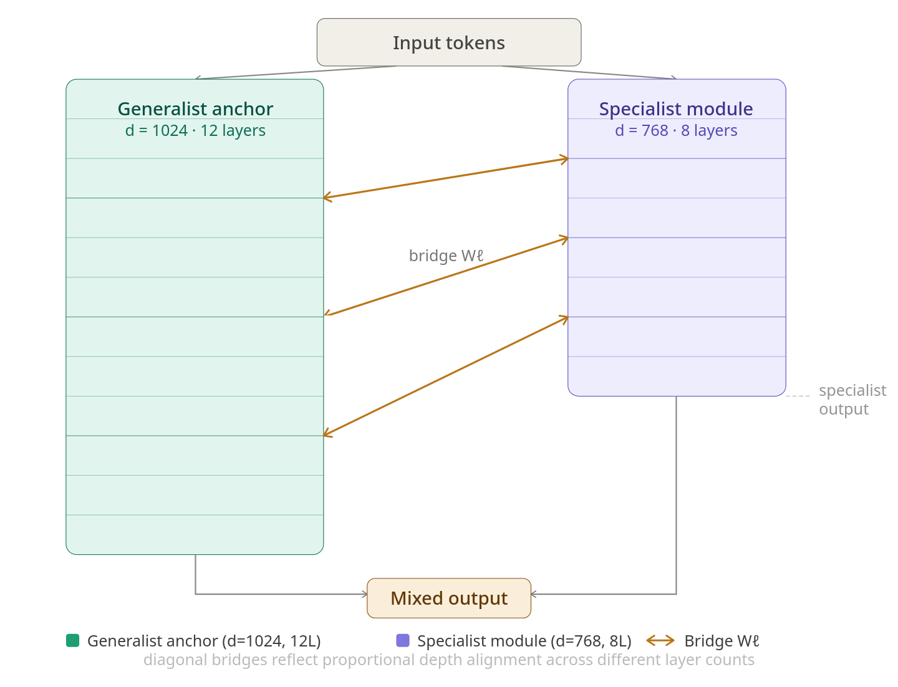
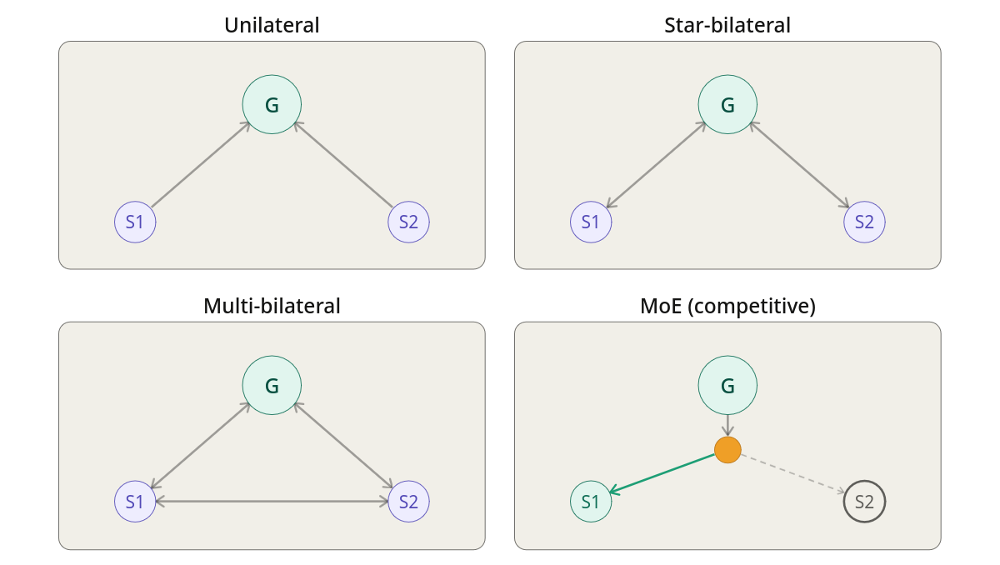

# Computing Between Models with Residual Coupling

[](https://ssrn.com/abstract=6746521)
[](LICENSE)
[](https://www.python.org/downloads/)
[](https://pytorch.org/)
[](https://huggingface.co/)

The standard approach to specializing a language model modifies it. Fine-tuning overwrites
weights: the updates that encode new domain knowledge simultaneously reactivate whatever was
memorized during pretraining, and no clean separation between the two effects exists.
Mixture-of-Experts routing commits each token to a single expert and discards the rest.
Agentic pipelines pass outputs between models as text, compressing each model's continuous
internal geometry into a discrete token sequence at every handoff. In all three cases, the
internal representations of one model do not directly influence the computations of another.

Residual Coupling (RC) takes a different route. Two or more frozen models are connected
through small learned bridge projections that read one model's hidden states and inject
corrective updates into another's residual stream at intermediate layers, during a single
parallel forward pass. No base weights are modified at any point. What trains is the map
between what the frozen models have separately memorized.

Where standard practice adds capacity by scaling individual models in depth and width, RC
adds capacity by training lightweight connections between models of fixed depth. Inference
latency is bounded by the slowest single model regardless of how many specialists are
coupled, because all model stacks execute in parallel. Specialists can be added by training
bridges to a new frozen module, and removed by deactivating their bridges in reverse order,
leaving all remaining components untouched and requiring no retraining.

`rescoupler` is the library implementation of this architecture.

---

## How it works

<div align="center">
  
</div>

The bridge at layer $\ell$ from specialist $S$ to generalist $G$ computes:

$$\delta \mathbf{h}_G^{(\ell)} = \sigma(g^{(\ell,\, S \to G)})\, W^{(\ell,\, S \to G)}\, \mathbf{h}_S^{(\ell)}$$

and adds it to the generalist's residual stream before layer $\ell + 1$ executes. The gate
$g$ initializes at $-2$ ($\sigma(-2) \approx 0.12$), so bridge contributions begin
small and scale up only as the training signal supports them. In bilateral mode a return
bridge runs simultaneously from $G$ to $S$, stabilizing both residual streams rather than
optimizing the fused output at the expense of either model's individual representations.

Projection matrices $W \in \mathbb{R}^{d_A \times d_B}$ handle dimensional mismatch between
heterogeneous models natively. Layer-count mismatch is resolved by proportional depth
alignment: the bridge at anchor layer $\ell$ reads from specialist layer
$\lfloor \ell \cdot L_S / L_A \rfloor$. Vocabulary mismatches across different tokenizers
are handled by clamping token indices before embedding lookups and padding logit bounds
before output mixing.

Because the bridge projections are linear, they can only navigate geometric relationships
that already exist between the frozen models' representation spaces. This is tractable
because independently trained transformers converge toward structurally compatible internal
geometries: the relative positions of concepts are approximately preserved across models
trained on different data. The linearity also means the bridge has no mechanism to propagate
model-specific confabulation. During training, the gate scalars learn to amplify projections
that produce consistent updates across both models and suppress projections that appear on
only one side.

### Topologies

<div align="center">
  
</div>

| Mode | Description |
|------|-------------|
| `multi_unilateral` | Specialists inject into the generalist only, no return flow |
| `star_bilateral` | Generalist and each specialist exchange bidirectionally, specialists do not bridge each other |
| `multi_bilateral` | All model pairs exchange bidirectional bridge updates |
| `moe` | Latent-space MoE baseline: soft-routes hidden states via a learned router at each bridge layer |

## Architectural implications

Operating on hidden states rather than output tokens, RC preserves geometric structure that
token-level pipelines discard. Standard agentic workflows compress each model's continuous
representations into a discrete token sequence at every handoff. RC runs all model stacks in
parallel, exchanging hidden states at bridge layers instead. The coding experiment quantifies
what this entails: CodeGPT-small-py is out of distribution on general text, and every
method that touches its output logits fails, while RC reaches a fused perplexity of 5.91 by
reading its hidden states directly.

Bridge linearity limits the projections to geometric relationships that already exist between
the frozen models' representation spaces. A linear map has no mechanism to invent or
propagate model-specific confabulation. Gate scalars reinforce this during training by
amplifying projections that produce consistent cross-model updates and suppressing those that
appear on only one base model.

Keeping memorization in frozen base models and relational alignment in bridges separates the
two functions at the architectural level. The same structure applies to multimodal settings:
a language model and a vision encoder, both frozen, could exchange bridge updates on their
residual streams without modification of either.

Distributed deployment is the natural next step. A specialist on an edge device and a
generalist on a remote server would exchange hidden states at each bridge layer rather than
full outputs, with neither model's weights exposed to the other party. Because bilateral
coupling improves each model's individual output alongside the fused output, the edge device
could generate useful responses independently while connected.

---

## Installation

```bash
pip install torch transformers datasets tqdm
```

Clone the repository and import directly:

```bash
git clone https://github.com/pfekin/residual-coupling.git
cd residual-coupling
```

```python
from rescoupler import ResidualCoupler, SteeredTrainer
```

---

## Quickstart

The example below couples a GPT-2 generalist with a DialoGPT specialist on medical
conversational data and runs a 2,000-step bridge training session.

```python
import torch
import torch.nn.functional as F
from transformers import AutoModelForCausalLM, AutoTokenizer
from datasets import load_dataset
from rescoupler import ResidualCoupler, SteeredTrainer

DEVICE = "cuda" if torch.cuda.is_available() else "cpu"

# Load tokenizer and base models
tokenizer = AutoTokenizer.from_pretrained("gpt2")
tokenizer.pad_token = tokenizer.eos_token

generalist = AutoModelForCausalLM.from_pretrained("gpt2")
specialist = AutoModelForCausalLM.from_pretrained("microsoft/DialoGPT-small")

# Initialize the coupler (base weights are frozen by default)
model = ResidualCoupler(
    anchor_model=generalist,
    specialist_models=[specialist],
    mode="multi_bilateral",
    device=DEVICE
).to(DEVICE)

# Only bridge parameters are trainable
optimizer = torch.optim.AdamW(
    filter(lambda p: p.requires_grad, model.parameters()), lr=1e-4
)

# Connect a streaming dataset
raw_dataset = load_dataset(
    "lavita/ChatDoctor-HealthCareMagic-100k", split="train", streaming=True
)

def train_stream():
    for ex in raw_dataset:
        text = (
            f"Patient: {ex.get('instruction', '')[:100]} "
            f"Doctor: {ex.get('output', '')[:100]}"
        )
        yield tokenizer(
            text, return_tensors="pt", max_length=128, truncation=True
        ).input_ids.to(DEVICE)

def quick_eval(model):
    test_batch = next(train_stream())
    with torch.no_grad():
        final_logits, _ = model(test_batch)
        loss = F.cross_entropy(
            final_logits[:, :-1, :].reshape(-1, final_logits.size(-1)),
            test_batch[:, 1:].reshape(-1)
        )
    print(f"Sample perplexity: {torch.exp(loss).item():.2f}")

trainer = SteeredTrainer(
    model=model,
    optimizer=optimizer,
    train_stream=train_stream(),
    eval_fn=quick_eval,
    eval_steps=500,
    gradient_accumulation_steps=4
)

trainer.train(max_steps=2000)
```

`ResidualCoupler` accepts either loaded `nn.Module` objects or Hugging Face model ID strings
in `specialist_models`. It resolves layer counts, hidden dimensions, and vocabulary sizes
automatically. Supported architectures include GPT-2 family (`model.transformer.h`) and
LLaMA / Mistral family (`model.model.layers`).

### `ResidualCoupler` parameters

| Parameter | Default | Description |
|-----------|---------|-------------|
| `anchor_model` | required | Generalist model (`nn.Module`) |
| `specialist_models` | required | List of specialists (`nn.Module` or HF model ID strings) |
| `mode` | `"multi_bilateral"` | Coupling topology (see table above; also `"multi_bilateral_no_gate"`, `"multi_bilateral_random"`, `"logit_ensemble"`) |
| `bridge_layers` | `None` | Explicit anchor layer indices for bridges; if `None`, distributed evenly |
| `num_bridge_layers` | `5` | Number of bridge layers when `bridge_layers` is unspecified |
| `freeze_transformers` | `True` | Freeze all base model weights |
| `trainable_bridges` | `True` | Allow bridge parameter updates |
| `device` | auto | `"cuda"` or `"cpu"` |

---

## Results

Three headline numbers from the experiments, all comparing bilateral RC against MoE routing
with the same frozen models:

- **Medical (three models):** multi-bilateral RC reduces perplexity to 11.02, against 56.80
  for MoE and 57.08 for the frozen baseline, an 80.7% reduction.
- **TruthfulQA Health (MC1):** factual accuracy improves by 9.1 percentage points over the
  frozen baseline, against 3.6 points for MoE. Each model's hallucinations are statistically
  uncorrelated with the other's, so the bridge gates learn to suppress them without any
  explicit objective for doing so.
- **Coding stress test:** CodeGPT-small-py and GPT-2 use different tokenizers, producing a
  frozen perplexity of approximately 7 million on mismatched text. MoE reaches 878. RC
  reaches 5.91 by reading hidden states before the output projection collapses them.

Full results across four domains, ablation study, and reproduction instructions:
[EXPERIMENTS.md](EXPERIMENTS.md)

---

## Citation

The paper covers the theoretical account of why frozen models can coordinate through linear
operators, grounded in the Platonic Representation Hypothesis and Maturana and Varela's
operational closure. It explains why the linearity constraint limits the bridge to generalizing 
rather than memorizing, and why frozen base weights make catastrophic forgetting structurally impossible.

[](https://ssrn.com/abstract=6746521)
Ekin, P. (2026). *Computing Between Models with Residual Coupling.* SSRN Electronic Journal.
https://ssrn.com/abstract=6746521

**BibTeX:**
```bibtex
@article{residual_coupling_2026,
  title   = {Computing Between Models with Residual Coupling},
  author  = {Pascal Ekin},
  journal = {SSRN Electronic Journal},
  year    = {2026},
  url     = {https://ssrn.com/abstract=6746521}
}
```

## Acknowledgements

Models via Hugging Face Hub. Datasets: `ChatDoctor-HealthCareMagic-100k`, `scotus`,
`python_code_instructions_18k_alpaca`, `pubmed-summarization`. TruthfulQA evaluation uses
the Health category of the MC1 split.

## References

- Huh, M., Cheung, B., Wang, T., and Isola, P. (2024). The Platonic Representation Hypothesis. arXiv:2405.07987.
- Kornblith, S., Norouzi, M., Lee, H., and Hinton, G. (2019). Similarity of neural network representations revisited. ICML.
- Liu, X., Mireshghallah, N., Ginsburg, J.C., and Chakrabarty, T. (2026). Alignment whack-a-mole: finetuning activates verbatim recall of copyrighted books in large language models. arXiv:2603.20957.
- Maturana, H. and Varela, F. (1980). Autopoiesis and Cognition: The Realization of the Living. Reidel.
- Mountcastle, V.B. (1978). An organizing principle for cerebral function. In Edelman, G.M. and Mountcastle, V.B. (Eds.), The Mindful Brain. MIT Press.
